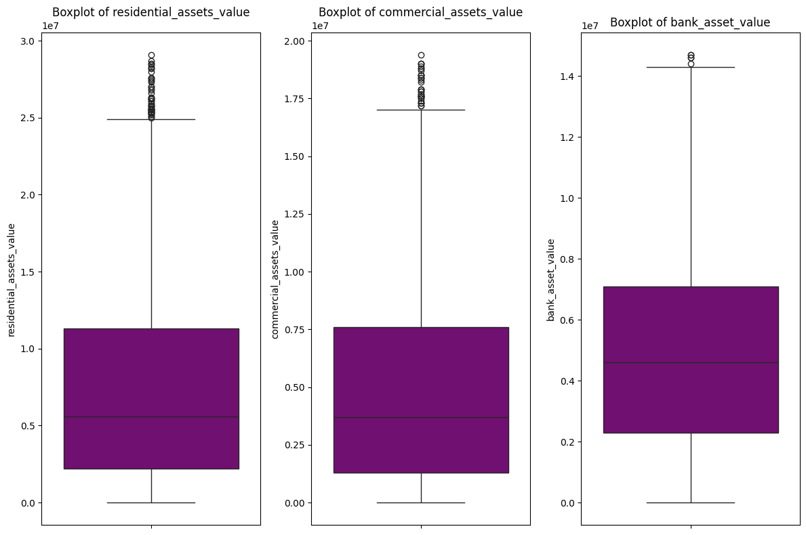
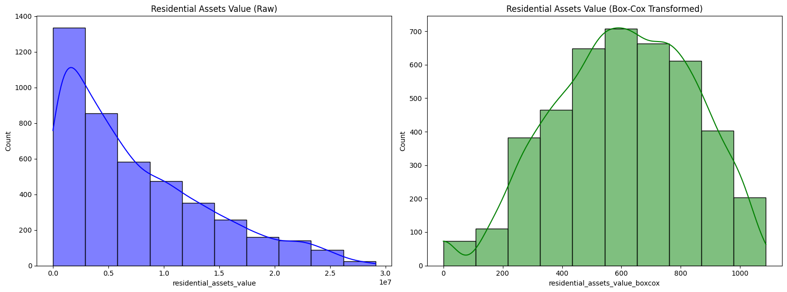
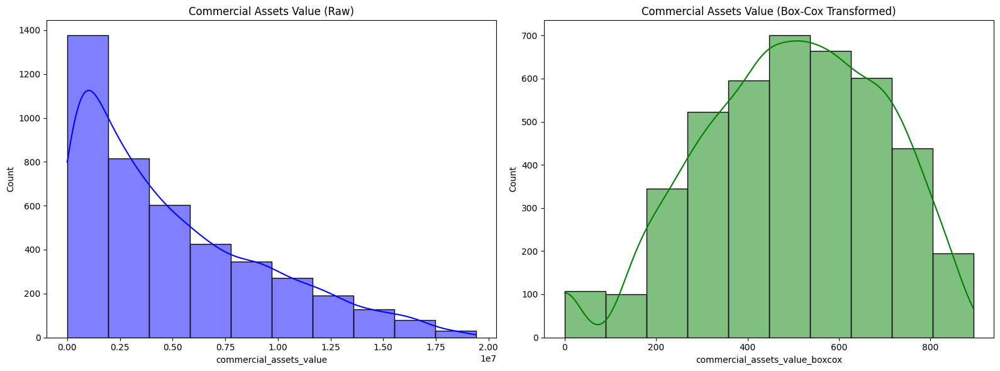
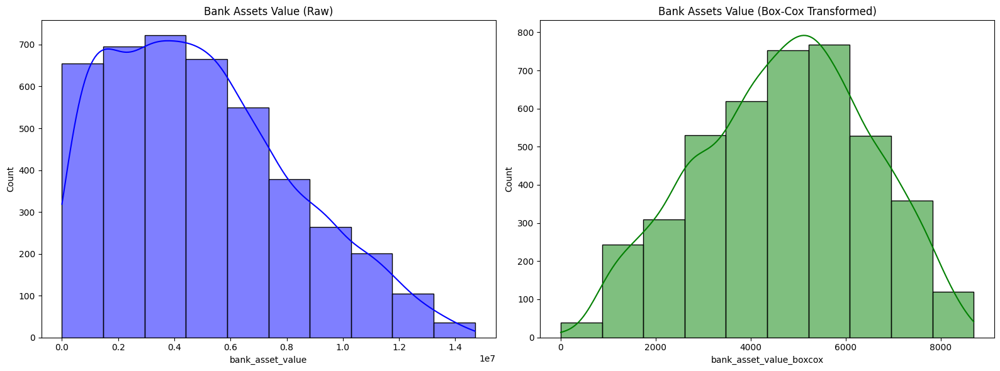
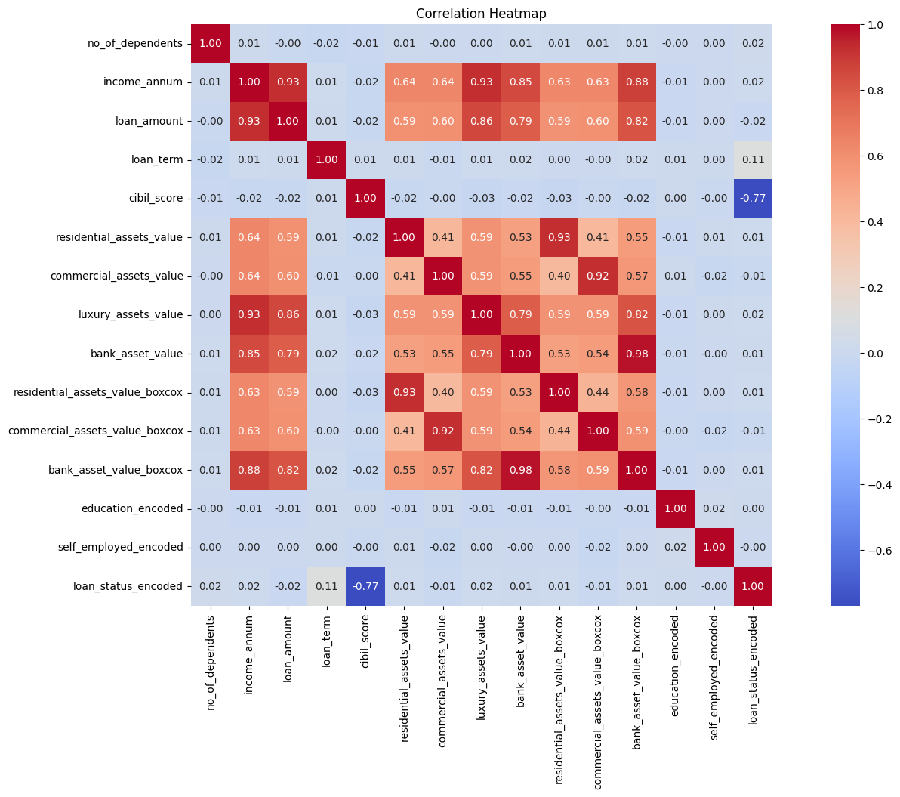
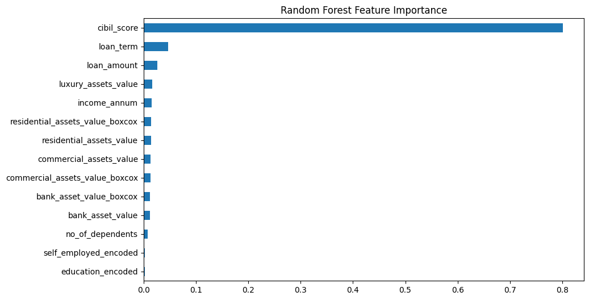
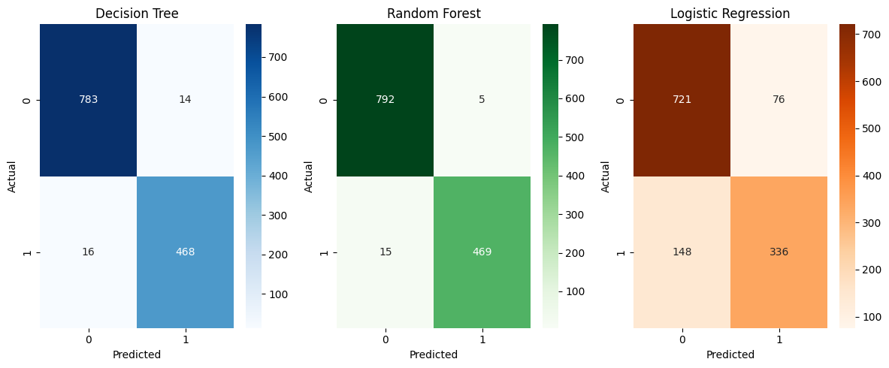
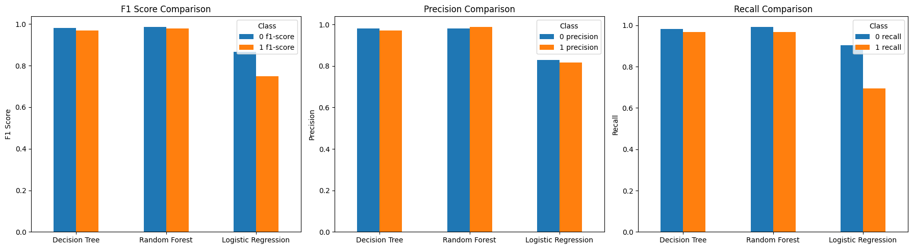

# Loan Approval Prediction

## 📌 Project Overview

This project focuses on predicting **loan approval outcomes** based on applicant financial and personal information.

The aim is to explore **which factors most influence loan approval** and compare multiple machine learning models for classification accuracy.

---

## 📊 Dataset Description

* **Total Records:** 4269
* **Features:** 13 (Applicant profile, financials, assets, and loan outcome)

### **Loan Applicant Profile**

* **Loan ID** → Unique identifier
* **Number of Dependents** → Integer, categorical-like
* **Education** → Categorical (2 categories)
* **Self-Employed** → Categorical (2 categories)

### **Financial Information**

* **Annual Income** → Integer (98 unique values)
* **Loan Amount** → Integer (378 unique values)
* **Loan Term** → Integer (10 unique values)
* **CIBIL Score** → Integer (601 unique values)

### **Assets Information**

* **Residential Assets Value** → Integer (278 unique values)
* **Commercial Assets Value** → Integer (188 unique values)
* **Luxury Assets Value** → Integer (379 unique values)
* **Bank Asset Value** → Integer (146 unique values)

### **Loan Outcome**

* **Loan Status** → Target variable (Approved / Rejected)

---

## ⚙️ Data Preprocessing

* **Outlier Treatment**
  * Outliers represent **genuine high-wealth applicants** and were  **not removed** .
  * Removing them would bias the sample and discard predictive information.
  * Tree-based models naturally handle outliers; for linear models, transformations were applied.

    
* **Box-Cox Transformation**
  * Applied on skewed asset values.
  * Helps stabilize variance and improve performance of logistic regression.
  * Original + transformed versions kept for A/B testing.

    

    

    
* **Target Variable Distribution**
  * Approved: **62.2%**
  * Rejected: **37.8%**
  * Dataset moderately imbalanced but not severe → No oversampling needed.

---

## 🔍 Feature Selection

### **Correlation Analysis**

* **Strongest Predictors:**

  * **CIBIL Score (r = –0.77)** → Strong negative correlation with rejection
  * **Loan Term (r = 0.11)** → Weak but relatively strongest positive correlation
* Other features showed negligible linear correlation.

  

### **Random Forest Feature Importance**

* **Top Predictors:** CIBIL Score, Loan Term, Loan Amount
* **Moderate Predictors:** Annual Income, Luxury Assets, Residential Assets (Box-Cox)
* **Low Predictors:** Bank Assets, Commercial Assets, Dependents, Education, Self-Employed

### **Overall Insight**

* **Core Predictors:** CIBIL Score, Loan Term
* **Supportive Predictors:** Loan Amount, Annual Income, Luxury Assets, Residential Assets
* **Weak Predictors:** Bank Assets, Commercial Assets, Dependents, Education, Self-Employed

---

## 🤖 Model Implementation

### 1. **Decision Tree**

* **Accuracy:** 97.6%
* **Highlights:** Balanced performance across both classes.

### 2. **Random Forest**

* **Accuracy:** 98.4%
* **Highlights:** Best performing model, high precision and recall for both classes.

### 3. **Logistic Regression**

* **Accuracy:** 82.5%
* **Highlights:** Performs significantly worse than tree models, struggles with minority class recall.

---

## 📈 Model Comparison

| Metric               | Decision Tree | Random Forest    | Logistic Regression |
| -------------------- | ------------- | ---------------- | ------------------- |
| Accuracy             | 0.9766        | **0.9844** | 0.8251              |
| Precision (Class 0)  | 0.98          | 0.98             | 0.83                |
| Recall (Class 0)     | 0.98          | **0.99**   | 0.90                |
| Precision (Class 1)  | 0.97          | **0.99**   | 0.82                |
| Recall (Class 1)     | 0.97          | 0.97             | 0.69                |
| F1-score (Macro Avg) | 0.9751        | **0.9833** | 0.8078              |

---

## ✅ Conclusion

* **Random Forest is the best model** → Highest accuracy and balanced class performance.
* **Decision Tree also strong** → Nearly as effective but slightly less robust.
* **Logistic Regression weaker** → Struggles with non-linear relationships and skewed features.
* **CIBIL Score & Loan Term are most influential** in determining approval outcomes.
